<div id="top"></div>

<!-- PROJECT [jovan-vukic] SHIELDS -->

<!-- PROJECT LOGO -->
<br />
<div align="center">
  <a href="https://github.com/jovan-vukic/filmpire">
    
  </a>

<h2 align="center">Confectionery Shop App</h2>

  <p align="center">
    Users can explore promotions, view details of available cakes and cookies, leave comments, and place orders directly from their mobile devices. The app allows customers to manage their shopping cart and receive notifications regarding their orders.
    <br />
    <a href="https://github.com/jovan-vukic/confectionery-shop"><strong>Explore the project »</strong></a>
    <br />
    <br />
    <a href="https://github.com/jovan-vukic/confectionery-shop/issues">Report Bug</a>
    ·
    <a href="https://github.com/jovan-vukic/confectionery-shop/issues">Request Feature</a>
  </p>
</div>

<!-- TABLE OF CONTENTS -->
<details>
  <summary>Table of Contents</summary>
  <ol>
    <li>
      <a href="#about-the-project">About The Project</a>
    </li>
    <li>
      <a href="#installation">Installation</a>
    </li>
    <li><a href="#contributing">Contributing</a></li>
    <li><a href="#license">License</a></li>
    <li><a href="#contact">Contact</a></li>
    <li><a href="#acknowledgments">Acknowledgments</a></li>
  </ol>
</details>

<!-- ABOUT THE PROJECT -->

## About The Project

The application is designed for Android devices. It's a straightforward project showcasing the creation of a user
interface for an application that provides the functionalities mentioned earlier. Currently, the application only allows
users to act as customers in the "Sweet Bites" store.

The application supports both light and dark themes, depending on the theme selected on the device. Below are the
application layouts for all usage scenarios, for guests and logged-in users.

<details>
   <summary style="font-weight: bold">Application user interface for Guests</summary>
   <br/>
   <p>Homepage with product listing</p>
   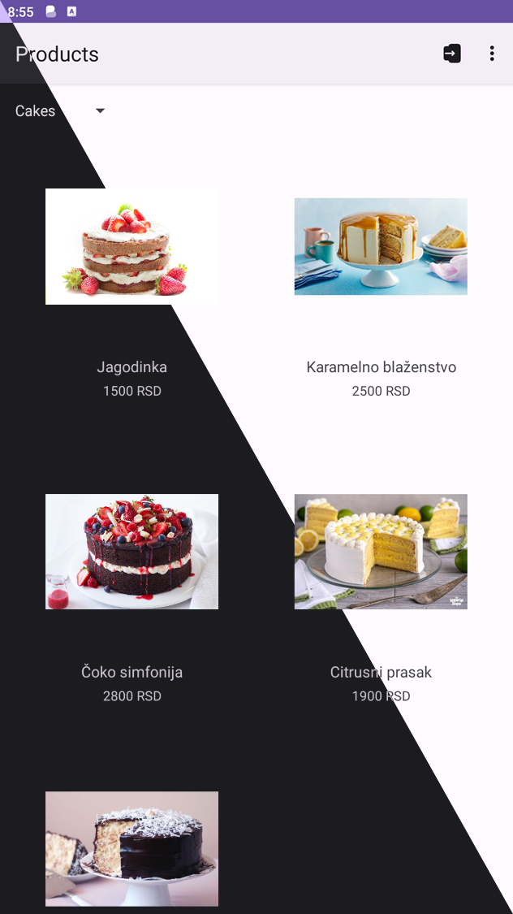
   <br/>
   <p>Choosing to display cakes or cookies</p>
   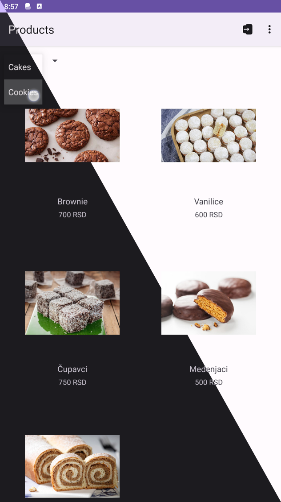
   <br/>
   <p>Product details</p>
   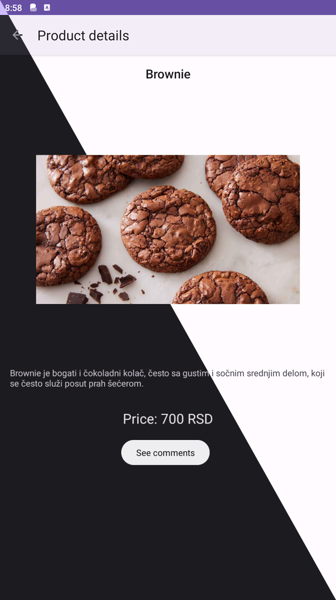
   <br/>
   <p>Comments about the product</p>
   
   <br/>
   <p>Menu options ("Promotions" and "About us")</p>
   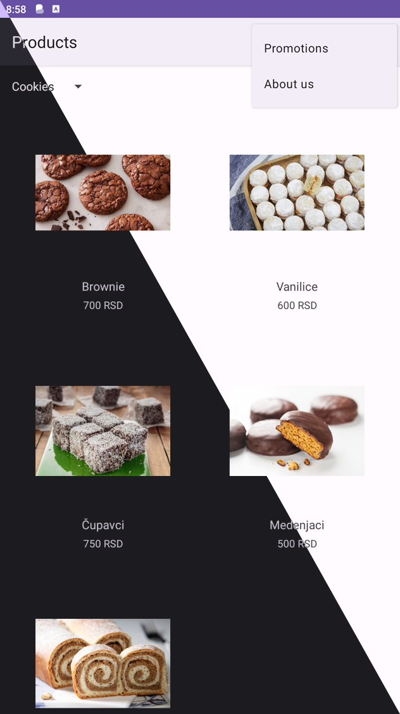
   <br/>
   <p>Layout of the Promotions page (carousel with promotions)</p>
   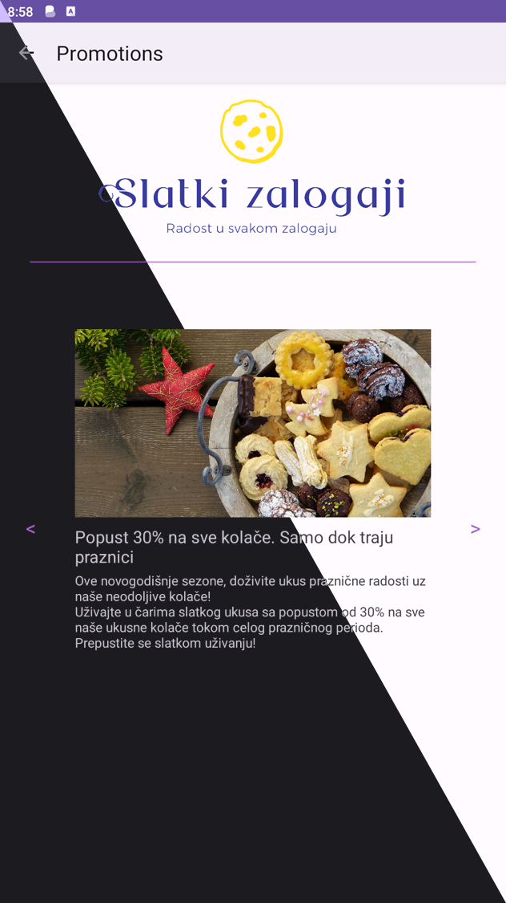
   <br/>
   <p>Layout of the About us page</p>
   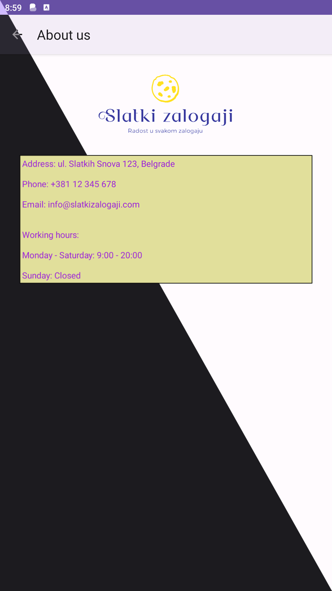
   <br/>
   <p>User login page</p>
   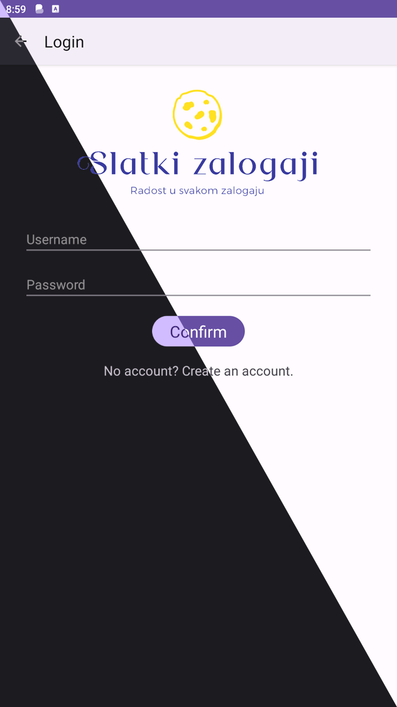
   <br/>
   <p>New user registration page</p>
   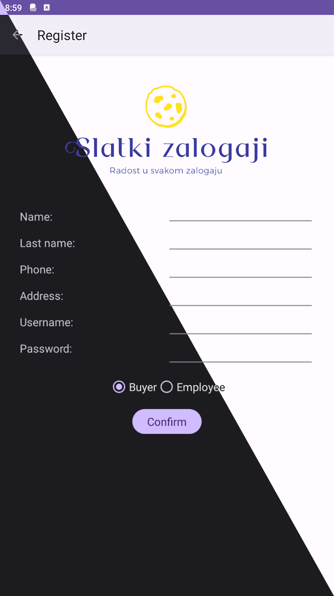
</details>

<details>
   <summary style="font-weight: bold">Application user interface for Buyers</summary>
   <br/>
   <p>Homepage with product listing</p>
   
   <br/>
   <p>Shopping cart (empty)</p>
   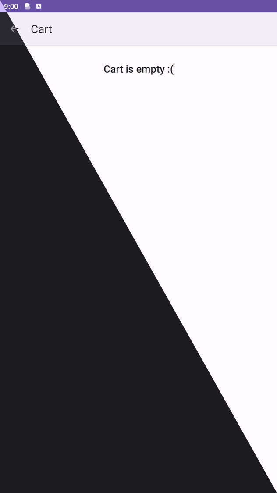
   <br/>
   <p>User-specific menu options</p>
   
   <br/>
   <p>Page with order notifications (empty)</p>
   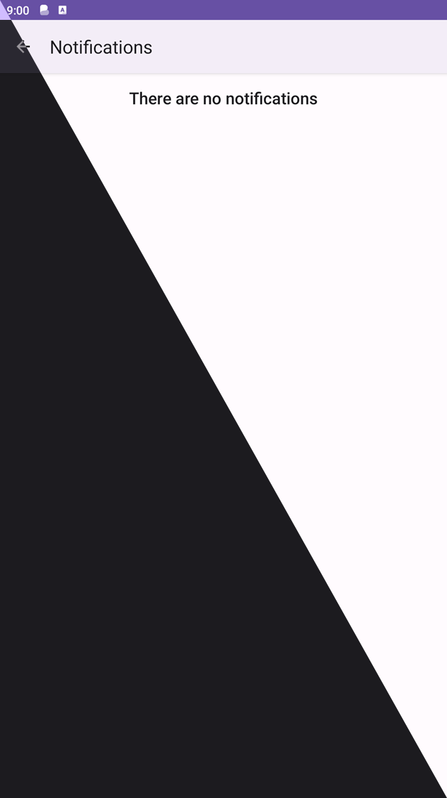
   <br/>
   <p>Page for editing user details or password</p>
   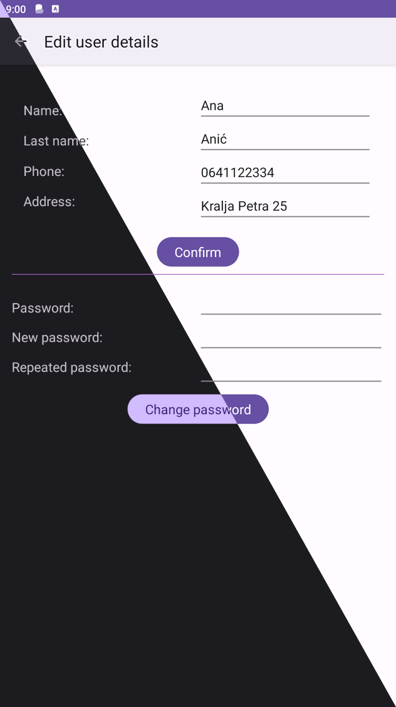
   <br/>
   <p>Product details</p>
   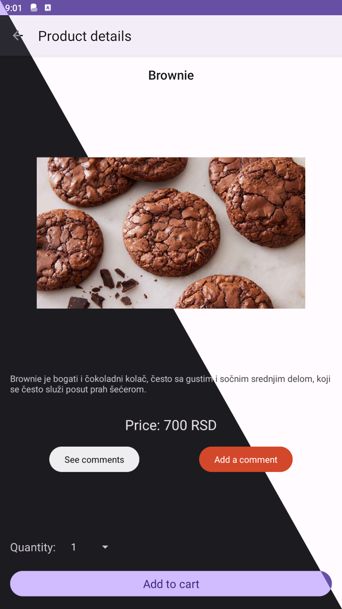
   <br/>
   <p>Adding a new comment</p>
   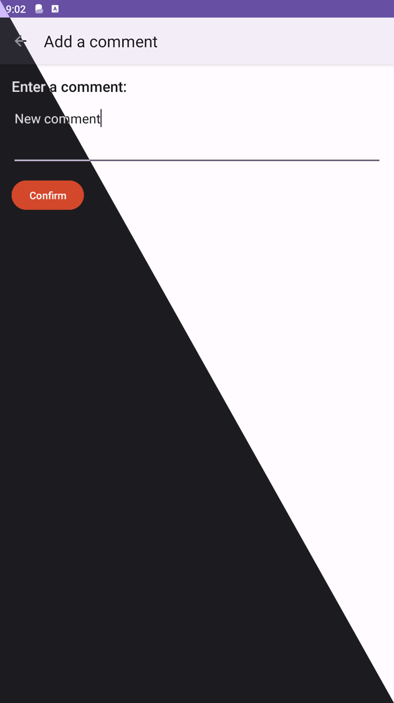
   <br/>
   <p>Comments about the product</p>
   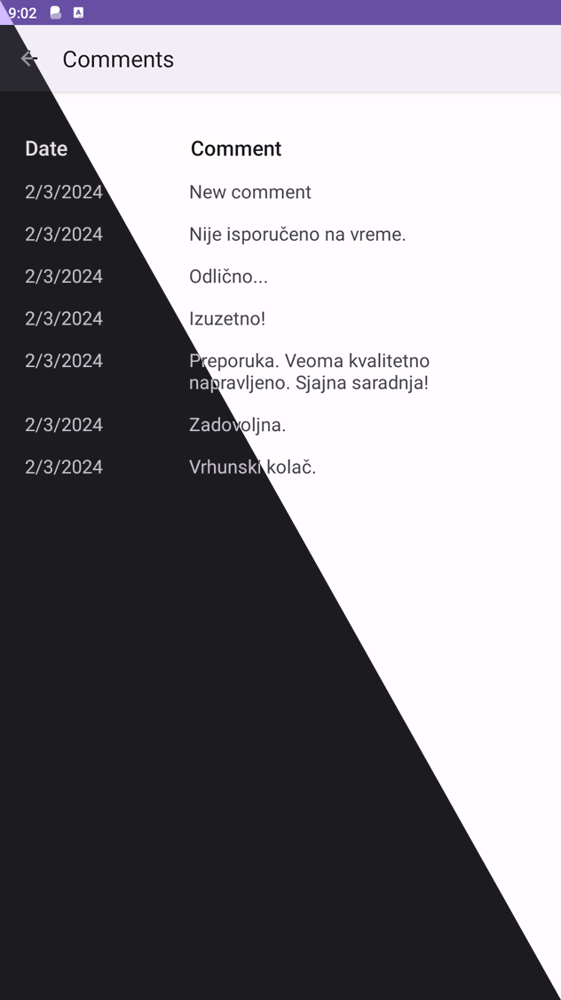
   <br/>
   <p>Layout of non-empty shopping cart</p>
   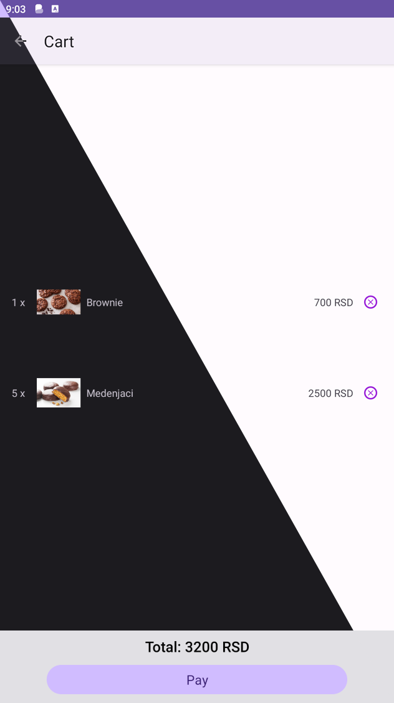
   <br/>
   <p>Received notifications about (un)approved orders</p>
   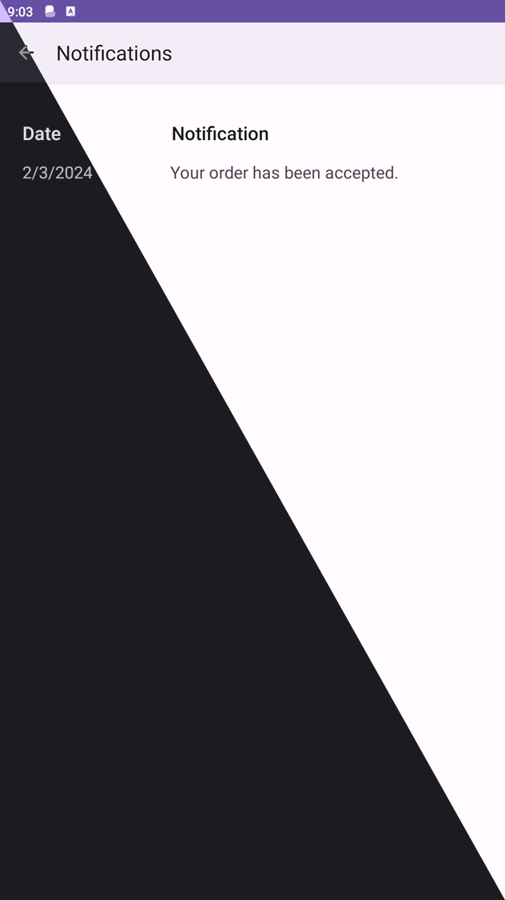
   <br/>
</details>

<p align="right">(<a href="#top">back to top</a>)</p>

<!-- GETTING STARTED -->

## Installation

To get a local copy up and running follow these simple steps.
Setup:

1. Clone the repository:
   ```sh
   git clone https://github.com/jovan-vukic/confectionery-shop.git
   ```
2. Build and run the project using your preferred IDE.

<p align="right">(<a href="#top">back to top</a>)</p>

<!-- CONTRIBUTING -->

## Contributing

Contributions are what makes the open source community such an amazing place to learn, inspire, and create. Any
contributions you make are **greatly appreciated**.

If you have a suggestion that would make this better, please fork the repo and create a pull request. You can also
simply open an issue with the tag "enhancement".
Don't forget to give the project a star! Thanks again!

1. Fork the Project
2. Create your Feature Branch (`git checkout -b feature/AmazingFeature`)
3. Commit your Changes (`git commit -m 'Add some AmazingFeature'`)
4. Push to the Branch (`git push origin feature/AmazingFeature`)
5. Open a Pull Request

<p align="right">(<a href="#top">back to top</a>)</p>

<!-- LICENSE -->

## License

Distributed under the MIT License. See `LICENSE` for more information.

<p align="right">(<a href="#top">back to top</a>)</p>

<!-- CONTACT -->

## Contact

Jovan - [@jovan-vukic](https://github.com/jovan-vukic)

Project
Link: [https://github.com/jovan-vukic/confectionery-shop](https://github.com/jovan-vukic/confectionery-shop)

<p align="right">(<a href="#top">back to top</a>)</p>

<!-- ACKNOWLEDGMENTS -->

## Acknowledgments

This project was done as part of the course 'User Interface Design' (13M111PKI) at the University of
Belgrade, Faculty of Electrical Engineering.

Used resources:

* [The full specification of the project in Serbian language](./docs/project%20specification.pdf)

<p align="right">(<a href="#top">back to top</a>)</p>
